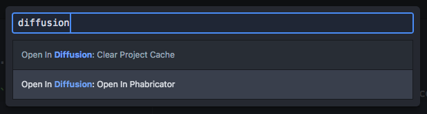
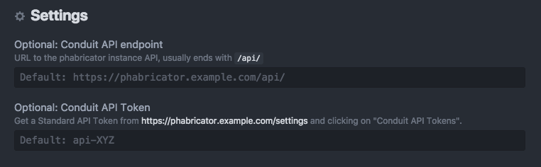
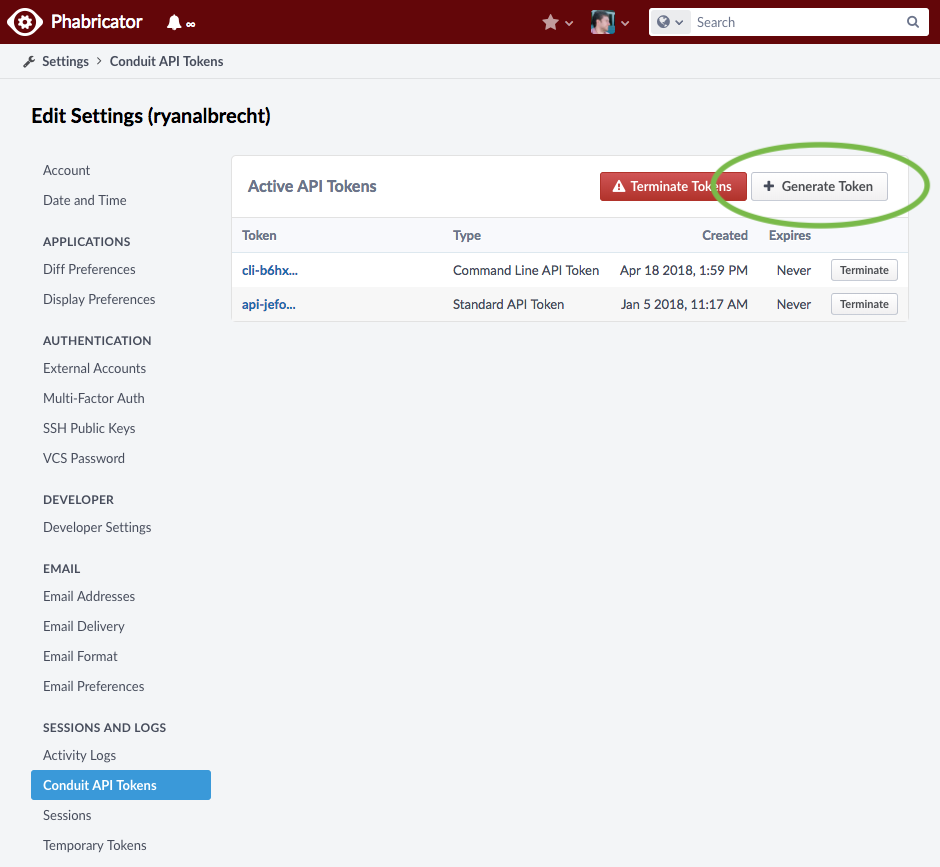

# open-in-diffusion package

Open the current file in the Phabricator/Diffusion web UI.

Just open a file, run the "Open In Diffusion: Open In Phabricator" command, & see file in your browser!

The command looks like this:

## Reporting Bugs/Feature Requests

Open an issue or pull request on [github](https://github.com/ryan953/atom-open-in-diffusion/issues).

## Setup

This plugin tries to read `~/.arcrc` by default for conduit credentials, falling through manually set settings in atom.

#### Option 1: Setup `arc`

1. Follow the [Installing Arcanist](https://secure.phabricator.com/book/phabricator/article/arcanist/#installing-arcanist) steps to setup the `arc` command on your computer.
2. Run `arc install-certificate` in your terminal.

If you can run `arc diff` from your computer then open-in-diffusion will work.

#### Option 2: Atom Settings

Enter your conduit host/token information in the plugin settings:
  

1. The Condiut API endpoint is the domain where phabricator is installed with the `/api/` path.
2. Then, you can visit the `/setttings` page to get your api token.
  - Click the "Generate Token" button in the top-right.

    
